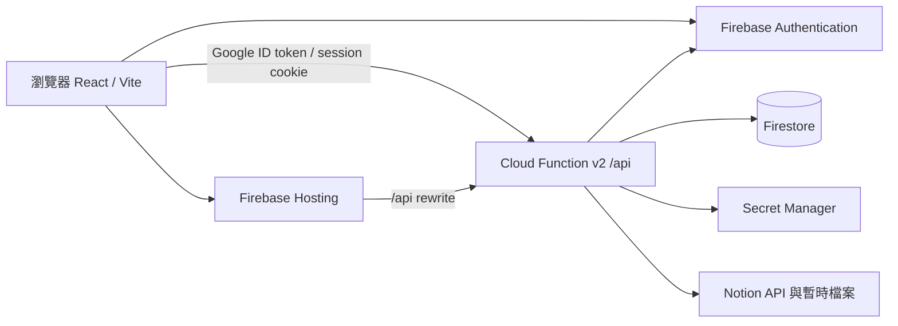

# Notion Media Library

[](https://github.com/jason7773/notion-media-library/actions/workflows/ci.yml)
[](LICENSE)
[](https://notion-based-vedio-music-web.web.app/)

一套已公開原始碼、可自行部署的私人影音資料庫。你在 Notion 管理專輯、曲目、影片、封面與字幕；網站使用 React/Vite 顯示媒體庫，由 Firebase Authentication、Cloud Functions 與 Firestore 處理登入、權限、播放進度及管理功能。

Notion integration token 只存在後端。瀏覽器不會取得 token，也不能直接讀寫 Firestore；媒體播放前，後端會重新確認頁面屬於指定的 Notion data source。

> 本專案的 MIT License 只授權程式碼。請只使用你擁有或已取得播放、展示及再散布授權的音樂、影片、封面與字幕。

## 線上 Demo 與公開狀態

- **線上 Demo：<https://notion-based-vedio-music-web.web.app/>**
- **公開原始碼：<https://github.com/jason7773/notion-media-library>**

截至 2026-09-24，公開 repository、MIT License、GitHub Actions CI 與 Firebase Demo 均已上線。本次驗收確認最新版 CI 成功、本機 37 項測試通過、production build 成功，且 Demo 可載入並播放 2 張專輯與 2 部影片。

Demo 不需登入，內容來自獨立的公開 Notion data source，不是私人媒體庫的鏡像。訪客的播放進度、偏好、願望清單與問題回報只留在瀏覽器；私人目錄、管理功能與 Firestore 資料仍需通過邀請及 Google 登入。

相依性稽核結果：前端／根目錄 `npm audit` 為 0 個已知弱點；Functions 尚有 8 個 moderate，全部來自 `firebase-admin` 的間接 `uuid` 相依鏈，目前沒有 critical 或 high。`firebase-functions` 7.2.5 尚未支援 `firebase-admin` 14，因此本專案不以破壞 peer compatibility 的方式強制升級，待上游支援後再更新。

## 目錄

- [線上 Demo 與公開狀態](#線上-demo-與公開狀態)
- [這個專案能做什麼](#這個專案能做什麼)
- [技術細節與系統架構](#技術細節與系統架構)
- [部署前準備](#部署前準備)
- [完整部署教學](#完整部署教學)
- [部署後怎麼使用](#部署後怎麼使用)
- [更新、驗證與排錯](#更新驗證與排錯)
- [安全、費用與限制](#安全費用與限制)

## 這個專案能做什麼

### 音樂庫

- 以 Notion 的每一列代表一張專輯，專輯頁面中的音訊／FLAC blocks 代表曲目。
- 支援搜尋、年份與類型篩選、播放佇列、隨機播放、重複播放及 Media Session。
- 讀取 FLAC metadata，並在播放前取得新的 Notion 暫時檔案 URL。

### 影片庫

- 支援 MP4、WebM、M4V、WebVTT 字幕、系列分組、續播與觀看紀錄。
- 可限制每位使用者存取全部影片、指定影片、指定系列或自訂組合。
- 使用者可以提交願望清單與影片問題回報，管理員可在後台處理。

### 登入與管理

- 前端使用 Firebase Google 登入，後端再把 ID token 換成五天效期的 HttpOnly session cookie。
- `ADMIN_EMAILS` 中的帳號是啟動管理員；其他帳號必須先由管理員邀請，不能自行註冊進入私人媒體庫。
- 管理後台可管理使用者、功能權限、影片範圍、願望清單、問題回報與稽核紀錄。

### 公開 Demo（可選）

- 訪客使用與私人媒體庫相同的專輯、影片、搜尋、播放器、字幕與續播介面，內容讀取獨立的 Demo Music／Demo Video data source。
- Demo Music 與私人音樂使用相同 schema，並在專輯增加 `Published` 勾選；勾選後該專輯及其全部曲目會公開。
- Demo Video 與私人影片使用相同 schema，並在影片增加 `Published` 勾選；Demo API 不讀取私人目錄，也不建立 Firebase 匿名帳號。
- Demo catalog 不回傳 Notion 原始暫時媒體或封面 URL；前端只使用受控的 `/api/demo/**` 路徑。
- Demo 的進度、播放器偏好、願望清單與影片回報只存訪客瀏覽器，介面會標明不會送到管理員；管理後台不開放給訪客。
- 登入並通過邀請核准的帳號會切換到私人媒體庫；未核准帳號留在 Demo。

## 技術細節與系統架構

| 層級 | 技術 | 責任 |
| --- | --- | --- |
| 前端 | React 19、Vite 8、Tailwind CSS 4 | 音樂／影片介面、Firebase 登入、播放器 |
| 靜態網站 | Firebase Hosting | 提供 `dist/`，並把 `/api/**` rewrite 到 Function |
| 後端 | Cloud Functions v2、Node.js 22 | 驗證 session、查詢 Notion、代理封面／字幕／串流 |
| 身分 | Firebase Authentication | Google 登入與 token 驗證 |
| 使用者資料 | Firestore | 使用者、邀請、進度、事件、願望與回報；瀏覽器規則全部拒絕 |
| 媒體目錄 | Notion API | 專輯、曲目、影片、封面、字幕及 Demo 素材 |
| 影像處理 | `sharp` | 封面與海報縮圖 |



重要運作方式：

- 音樂目錄回應不包含可長期保存的媒體 URL；選擇專輯後才重新讀取曲目 URL。
- 影片與 Demo 播放前會重新驗證 Notion page 所屬 data source 和公開／使用者權限；公開影片通過驗證後才取得短效 Notion URL。
- 串流支援 HTTP Range；Notion 暫時 URL 過期時，後端會重新取得後再重試。
- 目錄、頁面與 Demo 預設分別使用約 24 小時、10 分鐘及 60 秒的 instance-local cache。剛更新 Notion 時，畫面不一定立即變更。
- Function 設定在 `us-central1`、`maxInstances: 10`、最長請求 3600 秒。

更完整的信任邊界與播放流程見 [docs/architecture.md](docs/architecture.md)，公開版本的隔離原則見 [docs/open-source-roadmap.md](docs/open-source-roadmap.md)。英文技術文件見 [README.en.md](README.en.md)。

## 部署前準備

你需要：

1. Git。
2. Node.js 22 與 npm。
3. 可建立專案的 Google／Firebase 帳號。
4. Firebase 專案；Cloud Functions 部署通常需要 Blaze 計費方案。
5. 可建立 connection 的 Notion workspace 權限。
6. 自己的合法影音素材。

先下載並安裝依賴：

```bash
git clone https://github.com/jason7773/notion-media-library.git
cd notion-media-library
npm ci
npm --prefix functions ci
npm test
npm run build
```

預期結果是測試全部通過，而且 Vite 在 `dist/` 產生正式版檔案。

## 完整部署教學

### 1. 建立 Firebase 專案

1. 到 [Firebase Console](https://console.firebase.google.com/) 建立專案。
2. 將方案升級為可部署 Cloud Functions 的 Blaze 方案，並建議先設定預算通知。
3. 在專案設定中新增 Web App（`</>`），複製 Firebase Web SDK 設定值。
4. 到 **Authentication → Sign-in method**，啟用 **Google** 登入並選擇支援信箱。
5. 建立 Cloud Firestore Standard edition database。資料位置請慎選；建立後通常不能更改。
6. 不需要手動建立 Firestore collections，第一次登入、邀請或播放後，後端會建立需要的文件。

本專案會部署 `firestore.rules`，規則刻意拒絕瀏覽器直接讀寫。所有使用者資料都經由 Cloud Function 與 Admin SDK 存取。

### 2. 建立 Notion connection

1. 在 Notion 進入 **Settings → Connections**，開啟 Developer Mode 並建立新的 internal connection。
2. 只需要讀取內容的能力；複製 internal connection token，稍後存入 Firebase Secret Manager。
3. 分別開啟下方建立的音樂、影片與 Demo database 頁面，從右上角 `•••` 選單把 connection 加到頁面。
4. connection 沒有被加入資料庫頁面時，Notion API 會回傳 404；只有建立 token 還不夠。

Notion 官方操作可參考 [建立 internal connection](https://www.notion.com/help/create-integrations-with-the-notion-api) 與 [把 connection 加到頁面](https://www.notion.com/help/add-and-manage-connections-with-the-api)。

### 3. 建立 Notion 音樂 data source

建立一個 full-page database，屬性名稱與大小寫請完全一致：

| 屬性 | Notion 類型 | 必要 | 用途 |
| --- | --- | --- | --- |
| `Name` | Title | 是 | 專輯名稱 |
| `Artist` | Text | 是 | 演出者 |
| `Year` | Number | 否 | 排序與篩選 |
| `Genre` | Select | 否 | 類型篩選 |
| `Cover` | Files & media | 否 | 第一個檔案作為封面 |

每一列是一張專輯。打開專輯頁面後，依播放順序加入：

- Notion `Audio` block；或
- 檔名以 `.flac` 結尾的 `File` block。

### 4. 建立 Notion 影片 data source

| 屬性 | Notion 類型 | 必要 | 用途 |
| --- | --- | --- | --- |
| `Name` | Title | 是 | 影片名稱 |
| `Video` | Files & media | 是 | 第一個 MP4、WebM 或 M4V 檔案 |
| `Year` | Number | 否 | 排序與篩選 |
| `Genre` | Select / Multi-select | 否 | 類型，可多選 |
| `Series` | Select / Text | 否 | 系列分組 |
| `Series Order` | Number | 否 | 系列內排序 |
| `Cover` | Files & media | 否 | 第一個檔案作為海報 |
| `Subtitles` | Files & media | 否 | 一個或多個 `.vtt` 字幕 |
| `Audio Language` | Select / Text | 否 | 顯示音訊語言 |
| `Runtime` | Number | 否 | 片長（分鐘） |
| `Status` | Select | 否 | 顯示狀態 |

舊資料的 `Vedio` 拼字仍可使用，但新部署請使用正確的 `Video`。瀏覽器通常不能直接播放 MKV；請先轉成 MP4、WebM 或其他瀏覽器支援格式。字幕必須是 WebVTT（`.vtt`）。

### 5. 建立 Demo Music 與 Demo Video data source（可選）

要公開展示時，建立兩個獨立 data source，並把 Notion integration 加到兩者。兩個 Demo source 都必須與私人音樂／影片 source 使用不同 ID；若 ID 重複，Demo 會保持空白，避免誤公開私人目錄。

- **Demo Music**：複製音樂 data source 的 schema，另外新增 `Published`（Checkbox）。每一列仍是一張專輯，專輯頁面中的 Audio／FLAC blocks 仍是曲目。勾選專輯會公開這張專輯與頁面內所有合法音訊檔。
- **Demo Video**：複製影片 data source 的 schema，另外新增 `Published`（Checkbox）。只會公開勾選的影片頁及合法 MP4／WebM／M4V、封面與 WebVTT 字幕。
- 沒有要公開某一類內容時，可將對應的 Demo data source ID 留空；網站仍使用同一套介面，該目錄顯示空狀態。
- 從舊版升級且仍使用單一 `Demo Media` data source 時，可保留 `NOTION_DEMO_DATA_SOURCE_ID`。只要新版對應 ID 留空，後端會把舊版 Music／Video 列轉成同一套介面；新版 ID 一旦設定就會優先使用新版來源。
- 只放自有或明確取得展示及公開播放授權的影音；Demo API 每次讀取曲目、影片、封面或字幕時都重新驗證來源與 Published 狀態。

### 6. 取得 data source ID

這裡需要的是 **data source ID**，不是整個 Notion 頁面網址，也不要把 token 當成 ID。新版 Notion database 可以包含一個或多個 data sources；請從 database/data source 的連結或 Notion API 回應中取得對應 UUID。

你最後會有：

```text
NOTION_DATA_SOURCE_ID=音樂 data source ID
NOTION_VIDEO_DATA_SOURCE_ID=影片 data source ID
NOTION_DEMO_MUSIC_DATA_SOURCE_ID=Demo Music data source ID（可留空）
NOTION_DEMO_VIDEO_DATA_SOURCE_ID=Demo Video data source ID（可留空）
NOTION_DEMO_DATA_SOURCE_ID=舊版單一 Demo Media ID（僅升級相容，可留空）
```

如果部署後出現 Notion 404，優先檢查：ID 是否為 data source ID、connection 是否已加入該 database 頁面、以及 connection 是否屬於同一個 workspace。

### 7. 建立本機 `.env`

Windows PowerShell：

```powershell
Copy-Item .env.example .env
```

macOS／Linux：

```bash
cp .env.example .env
```

編輯 `.env`：

```dotenv
# 本機 Vite API 使用；不要提交
NOTION_TOKEN=ntn_your_real_token
NOTION_DATA_SOURCE_ID=your_music_data_source_id
NOTION_VIDEO_DATA_SOURCE_ID=your_video_data_source_id
NOTION_DEMO_MUSIC_DATA_SOURCE_ID=your_demo_music_data_source_id
NOTION_DEMO_VIDEO_DATA_SOURCE_ID=your_demo_video_data_source_id
# 只有舊版單一 Demo Media 部署才需要；新部署留空
NOTION_DEMO_DATA_SOURCE_ID=
ALLOWED_ORIGINS=http://localhost:5173,https://YOUR_PROJECT_ID.web.app,https://YOUR_PROJECT_ID.firebaseapp.com
ADMIN_EMAILS=your-google-account@example.com

# Firebase Console → Project settings → Your apps → Web app
VITE_FIREBASE_API_KEY=your_web_api_key
VITE_FIREBASE_AUTH_DOMAIN=YOUR_PROJECT_ID.firebaseapp.com
VITE_FIREBASE_PROJECT_ID=YOUR_PROJECT_ID
VITE_FIREBASE_STORAGE_BUCKET=YOUR_PROJECT_ID.firebasestorage.app
VITE_FIREBASE_MESSAGING_SENDER_ID=your_sender_id
VITE_FIREBASE_APP_ID=your_app_id

# 可選；不用 Analytics 就留空
VITE_GA_MEASUREMENT_ID=
```

注意：Firebase Web API key 會出現在前端 bundle，這是 Firebase Web App 的正常設計；真正必須保密的是 `NOTION_TOKEN`、服務帳號與其他後端憑證。

`.env`、`functions/.env.*`、`.firebaserc`、服務帳號、建置輸出與依賴目錄已列入 `.gitignore`。提交前仍應執行 `git status`，不要把真實設定加入 Git。

### 8. 安裝 Firebase CLI 並連結自己的專案

```bash
npm install --global firebase-tools
firebase login
firebase projects:list
firebase use --add
```

在 `firebase use --add` 選擇你剛建立的 Firebase 專案。這個公開 repository 故意不提供 `.firebaserc`，避免綁定到作者的 Firebase 專案。

Firebase CLI 的安裝與專案選擇方式可參考 [Firebase CLI 官方文件](https://firebase.google.com/docs/cli)。

### 9. 儲存 Notion token

不要把正式 token 寫進 Functions 程式碼或提交到 Git：

```bash
firebase functions:secrets:set NOTION_TOKEN
```

在提示時貼上 Notion internal connection token。部署後要更換 token，重新執行相同命令，再重新部署 Functions。

### 10. 第一次部署 Functions 與 Firestore

```bash
firebase deploy --only firestore,functions
```

第一次部署時 Firebase CLI 會詢問非機密參數，請填入：

| 參數 | 建議值 |
| --- | --- |
| `NOTION_DATA_SOURCE_ID` | 音樂 data source ID |
| `NOTION_VIDEO_DATA_SOURCE_ID` | 影片 data source ID |
| `NOTION_DEMO_MUSIC_DATA_SOURCE_ID` | Demo Music ID；不用公開音樂則留空 |
| `NOTION_DEMO_VIDEO_DATA_SOURCE_ID` | Demo Video ID；不用公開影片則留空 |
| `ALLOWED_ORIGINS` | `http://localhost:5173,https://PROJECT_ID.web.app,https://PROJECT_ID.firebaseapp.com` |
| `ADMIN_EMAILS` | 第一位管理員的 Google 信箱；多個以逗號分隔 |

舊版相容的 `NOTION_DEMO_DATA_SOURCE_ID` 不會由 CLI 主動詢問；需要時請加入 `functions/.env.<PROJECT_ID>`。新部署不需要設定。

這一步也會部署拒絕瀏覽器直接讀寫的 Firestore rules，以及後台查詢需要的 indexes。CLI 儲存的本機參數檔已被 `.gitignore` 排除。

### 11. 建置並部署 Hosting

先確認 `.env` 中的 `VITE_FIREBASE_*` 是你的 Web App 設定：

```bash
npm run build
firebase deploy --only hosting
```

也可以一次建置並部署 Hosting、Functions、Firestore rules 與 indexes：

```bash
npm run deploy
```

`npm run deploy` 會執行 `npm run build && firebase deploy`。請先確認目前選到的是自己的 Firebase 專案：

```bash
firebase use
```

### 12. 設定登入網域與第一位管理員

1. 到 Firebase Console 的 **Authentication → Settings → Authorized domains**。
2. 確認 `PROJECT_ID.web.app`、`PROJECT_ID.firebaseapp.com` 及使用中的自訂網域已被允許。
3. 開啟 `https://PROJECT_ID.web.app`。
4. 使用 `ADMIN_EMAILS` 中的 Google 帳號登入。
5. 第一次登入會自動建立管理員 profile；不需要手動修改 Firestore。
6. 進入管理後台先新增其他使用者邀請，再讓他們登入。未被邀請的帳號會被拒絕。

Firebase Google 登入設定可參考 [Firebase Authentication 官方文件](https://firebase.google.com/docs/auth/web/google-signin)。

### 13. 建議先用 Hosting preview 驗證更新

後續更新可先建立 preview channel：

```bash
npm run build
firebase hosting:channel:deploy preview
```

把 CLI 顯示的 preview 網域加入 Firebase Authentication authorized domains，也加入 `ALLOWED_ORIGINS` 後重新部署 Functions。確認登入、目錄、Range 播放、字幕及管理權限都正常，再部署正式 Hosting：

```bash
firebase deploy --only hosting
```

## 部署後怎麼使用

### 管理者

1. 在 Notion 新增或修改專輯／影片；網站會在 cache 更新後讀到變更。
2. 用 `ADMIN_EMAILS` 帳號登入並開啟管理後台。
3. 先建立使用者邀請，設定音樂、影片、續播等 feature flags。
4. 選擇影片存取模式：全部、指定影片、指定系列或自訂組合。
5. 在後台處理願望清單、影片回報、觀看紀錄與稽核紀錄。

### 一般使用者

1. 使用受邀請的 Google 信箱登入。
2. 在 Music 搜尋專輯、加入播放佇列並播放曲目。
3. 在 Video 選擇獲授權的影片、字幕與續播位置。
4. 可提交想看的內容或回報影片／字幕問題。

### 未登入訪客

- 使用與私人庫相同的媒體瀏覽及播放介面，只能看到各 Demo source 中 `Published=true` 的內容。
- 播放進度、願望清單、回報及播放器偏好只存本機瀏覽器，不會送到管理員或 Firestore。
- 未設定某一個 Demo source 時，對應目錄顯示空狀態；私人目錄仍不會被讀取。經核准的帳號登入後才會切換到私人庫。

## 更新、驗證與排錯

### 更新程式碼

```bash
git pull --ff-only
npm ci
npm --prefix functions ci
npm test
npm run build
firebase deploy
```

### 部署前驗收清單

- `npm test` 全部通過。
- `npm run build` 成功。
- `git status` 沒有 `.env`、token、服務帳號或媒體檔。
- `/api/demo/albums` 與 `/api/demo/videos` 只顯示各自 Demo source 中 `Published=true` 的內容。
- Demo 的影音、封面與字幕 API 會拒絕私人 source、未發布頁面及不屬於該專輯的曲目。
- 管理員能登入，未邀請帳號會被拒絕。
- 音樂、影片 Range、字幕、續播與登出都正常。
- Firebase Functions logs 沒有持續的 401、403、404、429 或 5xx。

### 常見問題

| 問題 | 優先檢查 |
| --- | --- |
| `Missing Firebase web config` | `.env` 是否包含全部 `VITE_FIREBASE_*`，修改後是否重新 build |
| Google popup 顯示 unauthorized domain | Authentication authorized domains 是否包含目前網域 |
| `This account is not allowed` | 信箱是否在 `ADMIN_EMAILS`，或管理員是否先建立邀請 |
| Notion API 401 | `NOTION_TOKEN` 是否正確、是否已重新部署 Functions |
| Notion API 404 | data source ID 是否正確、connection 是否已加入該 database 頁面 |
| 網站更新 Notion 後仍顯示舊內容 | 等待 cache TTL；目錄最長可能約 24 小時 |
| 影片無法播放 | 格式是否為 MP4/WebM/M4V、瀏覽器是否支援 codec、Range 回應是否成功 |
| 字幕不出現 | 是否為 `.vtt`、檔案是否放在 `Subtitles` property |
| CORS／session 失敗 | `ALLOWED_ORIGINS` 是否包含完整 origin（含 `https://`，不含路徑） |
| Firebase deploy 權限或計費錯誤 | CLI 帳號、目前 project、Blaze 方案及 Functions/Secret Manager 權限 |

查看後端日誌：

```bash
firebase functions:log --only api
```

## 安全、費用與限制

- Notion 檔案 URL 是暫時 URL，不要寫進 README、前端常數或長期資料庫。
- `NOTION_TOKEN` 必須放在 Firebase Secret Manager；懷疑外洩時應立即在 Notion 撤銷並建立新 token。
- Firebase Web config 不是管理員密鑰；服務帳號 JSON、Secret Manager 值與 Notion token 才需要保密。
- Firestore rules 目前拒絕所有瀏覽器讀寫；不要為了方便測試改成公開規則。
- `maxInstances: 10` 與 instance-local rate limit 只能降低部分意外費用，不是完整 DDoS 防護。
- Notion 並非專門的影音 CDN。大型檔案、長時間串流或公開高流量可能受到 Notion、Functions 與網路傳輸限制並產生費用。
- 正式公開 Demo 前，請設定 Firebase／Google Cloud 預算通知並監看 Function invocation、執行時間與 outbound traffic。

## 開發指令

```bash
npm run dev      # Vite + 本機 /api middleware
npm test         # Node.js 測試
npm run build    # 建立 dist/
npm run preview  # 預覽 dist/
npm run deploy   # build 後 firebase deploy
```

本機 `npm run dev` 可直接測試 Notion 目錄與 Demo。需要測試完整 Google session、Firestore 管理功能時，後端還必須具有該 Firebase 專案的 Admin credentials；對第一次部署者而言，通常先部署 Functions，再用 Hosting preview 驗證完整流程最簡單。

## 專案結構

```text
src/                    React 前端與 Firebase Web SDK
functions/index.js      Firebase HTTP Function 路由入口
functions/server/       驗證、Notion、目錄、串流、快取
test/                   Node.js 測試
docs/architecture.md    信任邊界與播放流程
firebase.json           Hosting / Functions / Firestore 部署設定
firestore.rules         拒絕瀏覽器直接存取
.github/workflows/      GitHub Actions CI
```

## 授權與貢獻

- 程式碼採 [MIT License](LICENSE)。
- 回報安全問題前請先閱讀 [SECURITY.md](SECURITY.md)。
- 提交修改前請閱讀 [CONTRIBUTING.md](CONTRIBUTING.md)。
- 影音內容的著作權、公開播放與再散布責任由各部署者自行確認。
