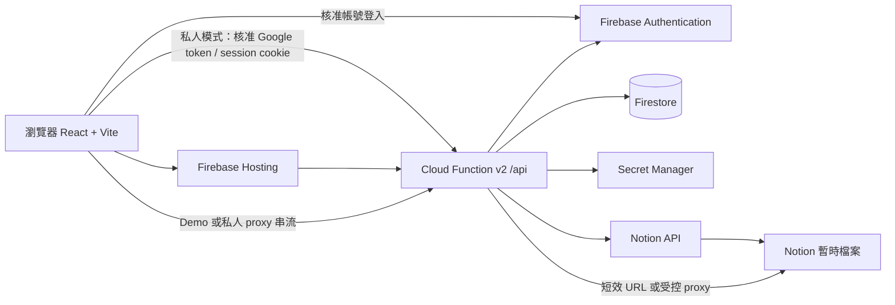
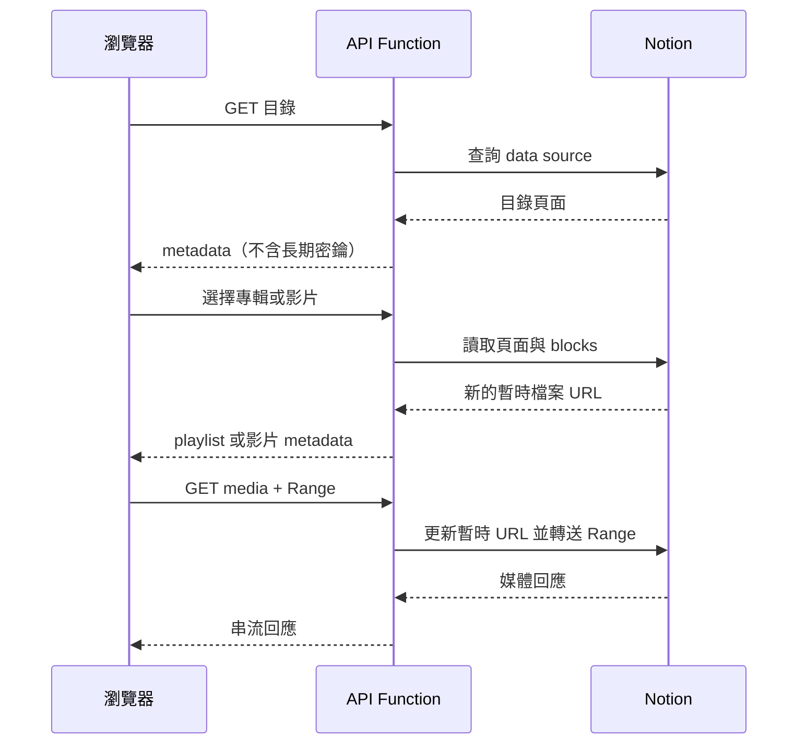

# 系統架構圖

## 系統總覽

Cloud Function 是媒體信任邊界：驗證 Notion page 所屬 data source 與 Demo `Published` 狀態，再套用私人模式的使用者影片權限；`NOTION_TOKEN` 永遠不會送到瀏覽器。Firestore rules 拒絕前端直接讀寫。Demo 個人資料只存在訪客瀏覽器，不會寫入 Firestore。

## 播放流程

## 部署剖面

Demo 與私人模式共用音樂／影片瀏覽及播放器介面。私人部署的目錄與雲端使用者資料必須經核准登入；Firestore 儲存私人模式進度與內容請求。Demo 使用相同 schema 的獨立 Demo Music、Demo Video Notion data source。

未登入訪客只能讀取兩個 Demo data source 中 `Published=true` 的專輯／影片，不能讀取私人 data source。進度、播放器偏好、願望清單與問題回報只存本機。Google 登入且帳號通過核准後，才會載入私人目錄與雲端功能。

## 運作限制

Notion 目錄與頁面使用 Function instance 內的 TTL cache；封面、字幕與 FLAC metadata cache 以筆數或位元組數限制，冷啟動後會清空。影音 proxy 支援瀏覽器 Range。Demo API 另有每個 instance 的 IP 讀取速率限制，Function 預設 `maxInstances` 上限可降低意外費用，但這不是完整的流量防護；正式公開前應監看 Function invocation 與網路傳輸。
