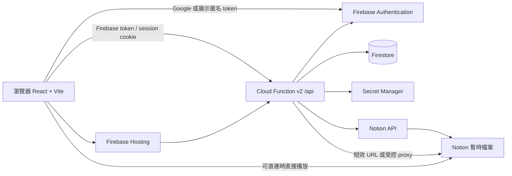
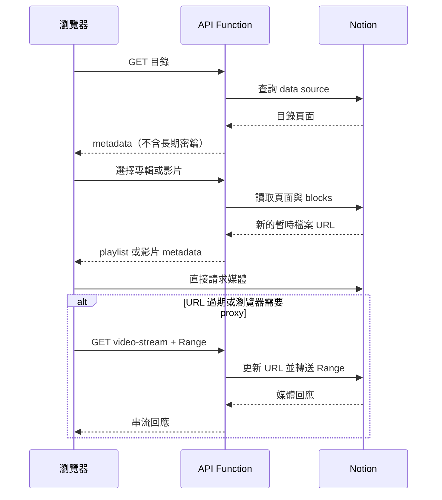

# 系統架構圖

## 系統總覽

Cloud Function 是信任邊界：先驗證 Notion page 是否屬於設定的 data source，再套用使用者影片存取規則；`NOTION_TOKEN` 永遠不會送到瀏覽器。Firestore rules 拒絕前端直接讀寫，所有使用者資料由後端處理。

## 播放流程

## 部署剖面

私人部署的目錄與使用者資料必須經核准登入；Firestore 儲存進度與內容請求。Demo 使用同一 Firebase project，但資料來自獨立的 `Demo Media` Notion data source。

未登入訪客只能讀取 `Published=true` 的 Demo 項目，不能讀取私人 data source；Google 登入成功且帳號通過核准後，才會載入完整私人目錄。

## 運作限制

Notion 目錄與頁面使用 Function instance 內的 TTL cache；封面、字幕與 FLAC metadata cache 以筆數或位元組數限制，冷啟動後會清空。影片與 Demo media proxy 不快取回應並支援瀏覽器 Range。Demo API 另有每個 instance 的 IP 讀取速率限制，Function 預設 `maxInstances` 上限可降低意外費用，但這不是完整的流量防護；正式公開前應監看 Function invocation 與網路傳輸。
